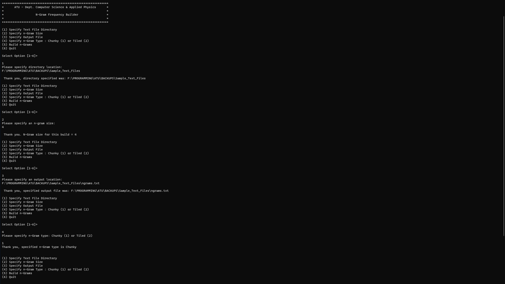
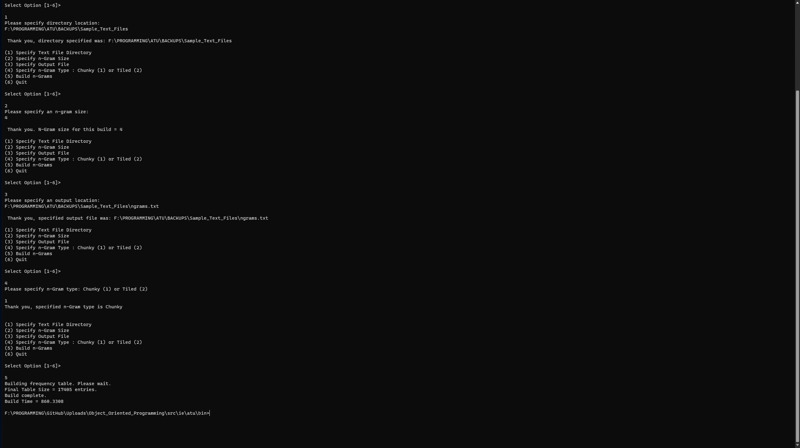
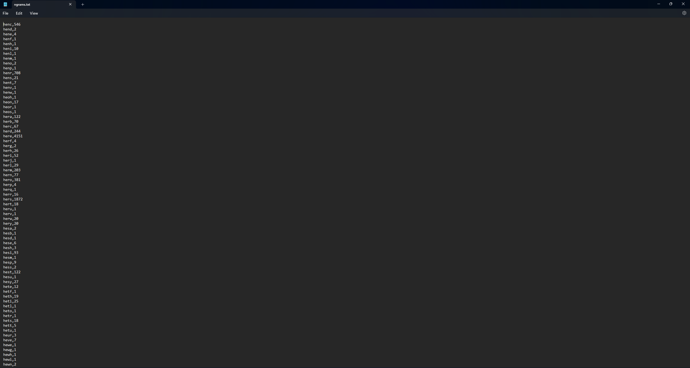
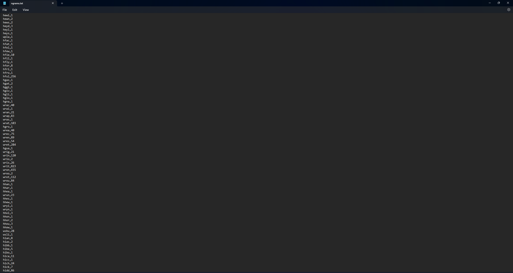
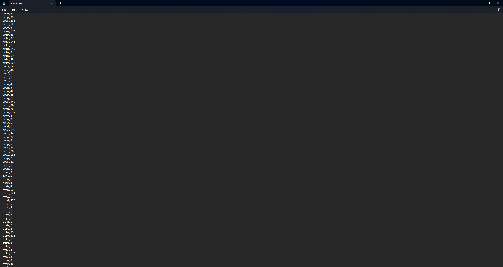

# N-gram_Frequency_Builder
 N-gram Frequency Builder project for Object-Oriented Programming module

**Original ReadMe:**

Program intakes user specified folder of text files, breaks folder
of files down progressively from lines to words and finally to 
n-grams with a user-defined size for n. 
A table is created with a column of unique n-grams and a second 
column with a count of occurrences of each n-gram across all 
parsed text files. 
Non-null table entries are counted and a new table is created to 
hold only the populated rows, then the final table is saved to a 
.csv file named by the user, found in the source folder.
When compiling, main method is in Runner class. 

---

**Instructions:**

To run the program using Command Prompt on Windows, first ensure that Java is installed by running the command "java -version" in the Command Prompt. Once java installation has been confirmed, navigate to the src folder and compile using the "javac" command. Once compiled, run the program using "java ie.atu.sw Runner". You will then be presented with a menu with prompts to input the location of the directory containing the text files to be parsed, the size of n-grams to be used, the output location for the finished file and the style of n-grams (Chunky or Tiled). Chunky indicates the next n-gram starts at the position after the last character in the previous n-gram, while tiled n-grams advance one character at a time, so the beginning of the next n-gram will be the second character in the previous n-gram. Once satisfied with your input, select the "Build n-grams" option. The output file will be saved to the user-defined location and the final table size and the duration of the build process will be shown. The program can now be closed.

---

**Demonstration of program in use:**

**Output of demonstration run:**

---
